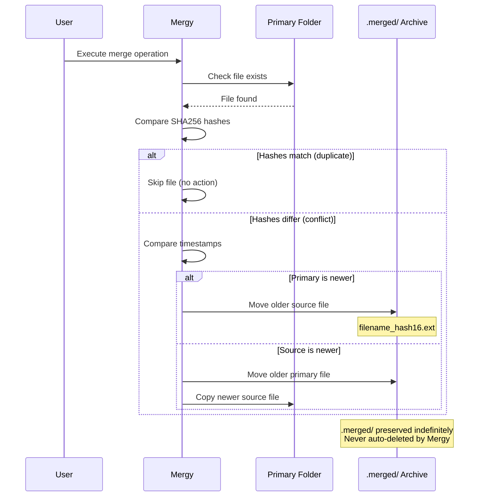

# Mergy - Computer Data Organization Tool

Intelligent folder merging CLI for duplicate computer backups.


**Quick Links:** [Installation](#installation) | [Quick Start](#quick-start) | [Usage](#usage-examples) | [Features](#features) | [Troubleshooting](#troubleshooting)

## Features

- **Multi-tier folder matching** - Exact prefix, normalized, token-based, and fuzzy matching with confidence scoring
- **Interactive Rich-based TUI** - Terminal user interface for merge selection and progress tracking
- **Safe merging with no data loss** - Conflicts moved to permanent `.merged/` archives with hash suffixes (never automatically deleted)
- **SHA256-based file comparison** - Accurate deduplication through content hashing
- **Dry-run mode** - Test operations without file system changes
- **Comprehensive structured logging** - Timestamped logs for audit trails
- **Cross-platform support** - Linux, macOS, and Windows

## Installation

### Method 1: Package Installation (Recommended)

```bash
pip install -e .
mergy --version
```

### Method 2: Direct Execution

```bash
pip install -r requirements.txt
python mergy.py --version
```

### Method 3: Standalone Executable

```bash
# Install PyInstaller
pip install pyinstaller

# Build executable
pyinstaller mergy.spec

# Run executable
./dist/mergy --version
```

### Requirements

- Python 3.11+
- Dependencies: typer, rich, rapidfuzz (see `requirements.txt`)

## Quick Start

1. **Scan folders to identify duplicates:**
   ```bash
   mergy scan /path/to/computerNames
   ```

2. **Review matches** in the output table with confidence scores

3. **Test merge with dry-run:**
   ```bash
   mergy merge /path/to/computerNames --dry-run
   ```

4. **Perform actual merge:**
   ```bash
   mergy merge /path/to/computerNames
   ```

5. **Review log file** `merge_log_YYYY-MM-DD_HH-MM-SS.log` for details

## Usage Examples

```bash
# Basic scan
mergy scan /path/to/computerNames

# Scan with lower confidence threshold
mergy scan /path/to/computerNames --min-confidence 50

# Dry-run merge (no file changes)
mergy merge /path/to/computerNames --dry-run

# Merge with custom log file
mergy merge /path/to/computerNames --log-file ~/merge-2024.log

# Verbose output for debugging
mergy merge /path/to/computerNames --verbose

# Show version
mergy --version
```

## Command Reference

| Command | Options | Description |
|---------|---------|-------------|
| `scan PATH` | `--min-confidence`, `--log-file`, `--verbose` | Analyze folders without modification |
| `merge PATH` | `--min-confidence`, `--dry-run`, `--log-file`, `--verbose` | Interactive merge process |

## Configuration Options

| Option | Description | Default |
|--------|-------------|---------|
| `--min-confidence` | Threshold for displaying matches (0-100) | 70 |
| `--dry-run` | Simulate merge without file system changes | False |
| `--log-file PATH` | Custom log file location | `merge_log_YYYY-MM-DD_HH-MM-SS.log` |
| `--verbose` | Enable detailed console output | False |

## Best Practices

- **Always run `scan` first** to understand matches before merging
- **Use `--dry-run`** to preview changes before actual merge
- **Start with default confidence (70%)** and adjust if needed:
  - Lower (50-60) for more matches
  - Higher (80-90) for precision
- **Review log files** after operations for detailed audit trail
- **Test on small subset** before processing large folder collections
- **Ensure sufficient disk space** (merging doesn't delete originals immediately)

### Managing .merged/ Directories

Treat `.merged/` directories as **permanent safety archives**, not temporary files to clean up:

- **Mergy never automatically deletes** `.merged/` directories—they are preserved indefinitely
- `.merged/` directories are **skipped during subsequent scans** to prevent re-processing
- **Minimum retention**: 30-90 days after merge completion
- **Recommended retention for critical data**: 6-12 months or longer
- **Never delete** `.merged/` directories without first creating external backups

**Before considering deletion:**
```bash
# Review what's in .merged/ directories
ls -lR /path/to/computerNames/*/.merged/

# Check total disk space used
du -sh /path/to/computerNames/*/.merged 2>/dev/null

# Document what you're deleting and when (maintain a deletion log)
```

Consider disk space vs. data safety trade-offs carefully. When in doubt, keep the `.merged/` directories—storage is cheaper than lost data.

## Troubleshooting

| Issue | Solution |
|-------|----------|
| "Base path does not exist" | Verify path spelling and permissions with `ls -la` |
| No matches found | Lower `--min-confidence` threshold (try 50-60) or check folder naming patterns |
| Permission denied errors | Run with appropriate user permissions or use `sudo` (caution advised) |
| Slow performance | Check disk I/O with `iostat`, reduce file count per operation, or use SSD |
| Memory issues | Process folders in smaller batches, close other applications |
| Long folder names display issues | Terminal width <80 columns may truncate; resize or use `--verbose` for full paths |
| Hash calculation errors | Check file permissions and disk health; corrupted files are skipped and logged |
| `.merged/` directories consuming disk space | This is expected—`.merged/` directories preserve all older file versions for safety. Review contents with `du -sh /path/*/.merged/`, verify data, then optionally archive and delete after 30-90+ days. Never delete without external backups. |
| Can I delete `.merged/` directories? | Only after: (1) thorough verification of merged data, (2) external backups created and verified, (3) minimum 30-90 day retention period, (4) absolute certainty older versions are not needed. Deletion is **permanent and irreversible**. See [Advanced: .merged Directory Cleanup](#advanced-merged-directory-cleanup-optional). |

## How It Works

### Four-Tier Matching Algorithm

1. **Exact Prefix Match** - Folders starting with identical base name (e.g., `computer-01`, `computer-01-backup`)
2. **Normalized Match** - After removing common suffixes and normalizing separators
3. **Token-Based Match** - Matching significant tokens within folder names
4. **Fuzzy Match** - String similarity for catching variations

### Conflict Resolution

- **Keep newer file** based on modification time
- **Move older file** to permanent `.merged/` archive subdirectory with 16-character hash suffix (preserved indefinitely, never auto-deleted)
- **Skip duplicates** when SHA256 hashes match (identical content)

### Understanding .merged Directories

`.merged/` directories are **permanent safety archives** created automatically during conflict resolution. Mergy **never automatically deletes** these directories—they preserve all older file versions for data recovery.

**Key behaviors:**
- Created at the **same level as conflicting files** (not at root)
- Naming convention: `filename_hash16chars.ext` where hash is first 16 characters of SHA256
- **Intentionally skipped** during all subsequent scans and merge operations
- Remain until **you manually delete them** after thorough verification

**Example structure after conflict resolution:**
```
primary-folder/
├── logs/
│   ├── system.log          # Newer version (kept in place)
│   └── .merged/
│       └── system.log_abc123def4567890  # Older version (archived)
├── config/
│   ├── settings.json       # Newer version (kept in place)
│   └── .merged/
│       └── settings.json_fedcba9876543210  # Older version (archived)
```



### Interactive Workflow

1. Scan folders for matches
2. Review match groups with confidence scores
3. Select folders to merge
4. Choose primary folder (merge target)
5. Confirm operation
6. Execute merge with progress tracking
7. View summary of operations

## Known Limitations

- Designed for ~3000 folders; sequential processing (no parallelization)
- No state persistence between runs; cannot resume interrupted operations
- Creation time (`st_ctime`) used for conflict resolution (not birth time on all platforms)
- Symlinks are followed (potential for loops if circular)
- Very long folder names (>60 chars) may truncate in TUI display
- Large files (>1GB) may slow hash calculation
- Network drives may have performance issues

## Maintenance Tasks

### Regular Tasks

```bash
# Review log files
ls -lh merge_log_*.log

# Monitor disk space for .merged directories
du -sh /path/to/computerNames/*/.merged

# Archive old log files
gzip merge_log_*.log
mv *.gz logs/archive/
```

### Advanced: .merged Directory Cleanup (Optional)

> **CRITICAL WARNING**: Deleting `.merged/` directories is **permanent and irreversible**. These directories contain the only copies of older file versions. Once deleted, this data **cannot be recovered**.

`.merged/` directories are **permanent safety archives**—Mergy never automatically deletes them. Manual cleanup is **optional** and should only be performed after:

1. **Thorough verification** of all merged data (confirm newer versions are correct)
2. **External backups created** and verified (see backup commands below)
3. **Minimum 30-90 day retention** (longer for critical/irreplaceable data)
4. **Absolute certainty** that older versions are truly not needed

**Safe cleanup procedure:**

```bash
# Step 1: Review .merged/ contents first
find /path/to/computerNames -type d -name ".merged" -exec ls -lh {} \;

# Step 2: Check total disk space used
du -sh /path/to/computerNames/*/.merged 2>/dev/null | sort -h

# Step 3: Create archive backup BEFORE deletion
tar -czvf merged-backup-$(date +%Y%m%d).tar.gz $(find /path/to/computerNames -type d -name ".merged")

# Step 4: Verify archive integrity
tar -tzf merged-backup-$(date +%Y%m%d).tar.gz | head -20

# Step 5: Store archive in separate location (external drive, cloud, etc.)
# Only after steps 1-4 are complete:

# Step 6: Delete .merged directories (PERMANENT - NO UNDO)
find /path/to/computerNames -type d -name ".merged" -exec rm -rf {} +
```

**Retention Guidelines:**

| Data Type | Minimum Retention | Recommended Retention | Notes |
|-----------|-------------------|----------------------|-------|
| Test/Development data | 30 days | 60 days | Lower risk, faster cleanup |
| Production data | 90 days | 6-12 months | Critical data, extended retention |
| Compliance/Audit data | 12 months | 3-7 years | Legal requirements may apply |
| Irreplaceable data | Indefinite | Indefinite | Never delete without external archives |

### Periodic Tasks

- Update dependencies: `pip install --upgrade typer rich rapidfuzz`
- Review and adjust confidence thresholds based on false positive/negative rates
- Test on sample data before large operations: use `examples/test_data/`
- Verify Python version compatibility: `python --version` (ensure 3.11+)

### Backup Recommendations

- Always maintain backups before merging large datasets
- Test merge operations on copies first
- Archive log files for audit trail (recommend 1 year retention)

**Treating .merged/ as part of your backup strategy:**

`.merged/` directories contain all older file versions and serve as your **version history**—valuable for data recovery:

- Keep `.merged/` directories for **minimum 30-90 days** after merge (longer for critical data)
- Consider `.merged/` directories as a first line of defense for recovering previous file versions
- Before deleting `.merged/` directories, create an external archive:

```bash
# Create compressed archive of all .merged/ directories
tar -czvf merged-archive-$(date +%Y%m%d).tar.gz /path/to/computerNames/*/.merged/

# Verify archive integrity
tar -tzf merged-archive-*.tar.gz | head

# Store archive in separate location (external drive, cloud storage)
# Document what was archived and the deletion date
```

- Only delete `.merged/` directories after archive is verified and stored separately

## Development

### Setup

```bash
# Clone repository
git clone <repository-url>
cd mergy

# Install in editable mode with dev dependencies
pip install -e ".[dev]"

# Run tests
pytest

# Run tests with coverage
pytest --cov=mergy --cov-report=html
open htmlcov/index.html
```

### Project Structure

- `mergy/models/` - Data models and enums (`ComputerFolder`, `FolderMatch`, etc.)
- `mergy/matching/` - Multi-tier folder matching algorithm
- `mergy/scanning/` - File hashing and metadata collection
- `mergy/operations/` - File system operations (copy, move, conflict resolution)
- `mergy/ui/` - Rich-based terminal user interface
- `mergy/orchestration/` - Workflow coordination and logging
- `mergy.py` - CLI entry point (re-exports from `mergy.cli`)
- `tests/` - Comprehensive test suite with unit, integration, and manual tests

### Testing

```bash
# Unit tests
pytest tests/test_*.py -k "not integration"

# Integration tests
pytest tests/test_*_integration.py

# Manual TUI tests
# Follow tests/manual_tui_testing.md

# Test coverage target: >90% for core modules
pytest --cov=mergy --cov-report=term-missing
```

### Code Organization

- Each package has `__init__.py` exporting public API
- Data models are immutable dataclasses with type hints
- All file operations use `pathlib.Path` for cross-platform compatibility
- Error handling: non-critical errors logged, critical errors abort

## Building Executables

### Prerequisites

```bash
pip install pyinstaller
```

### Build Process

```bash
# Build standalone executable
pyinstaller mergy.spec

# Output location
ls -lh dist/mergy      # Linux/macOS
dir dist\mergy.exe     # Windows
```

### Distribution

- Executable size: ~15-25 MB (includes Python runtime and dependencies)
- No Python installation required on target system
- Distribute `dist/mergy` (or `dist/mergy.exe`) as single file
- Include `README.md` and `LICENSE` with distribution

### Platform-Specific Notes

- **Linux**: Executable may require `chmod +x dist/mergy` on some systems
- **macOS**: May require code signing for distribution (see Apple Developer docs)
- **Windows**: Antivirus software may flag PyInstaller executables (false positive); consider code signing

### Testing Executables

```bash
# Verify version
./dist/mergy --version

# Test scan
./dist/mergy scan examples/test_data/computerNames

# Test dry-run merge
./dist/mergy merge examples/test_data/computerNames --dry-run
```

## Project References

- [AGENTS.md](AGENTS.md) - Full technical specification
- [tests/manual_tui_testing.md](tests/manual_tui_testing.md) - Manual testing scenarios
- [LICENSE](LICENSE) - MIT license details

## License

MIT License - see [LICENSE](LICENSE) for full text.

Copyright (c) 2025 cyrus104

## Support

- For bugs or feature requests, refer to the project repository
- For technical details, see [AGENTS.md](AGENTS.md) specification
