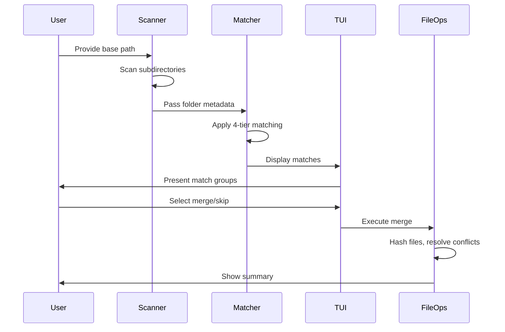

# Mergy - Intelligent Folder Deduplication Tool

A command-line tool for intelligently identifying and merging duplicate folders using multi-tier fuzzy matching, interactive selection, and safe conflict resolution.

## Key Features

- **Multi-Tier Matching Algorithm**: Four-tier matching from exact prefix to fuzzy matching with configurable confidence thresholds
- **Interactive TUI**: Rich terminal interface for reviewing matches and making merge decisions
- **Safe Merging**: SHA256-based conflict resolution with no data loss - older files preserved in `.merged/` subdirectories
- **Dry-Run Mode**: Full simulation without any file modifications
- **Comprehensive Logging**: Detailed operation logs for audit and verification
- **Progress Tracking**: Real-time progress bars and status updates

## Installation

### Method 1: Direct Execution

```bash
# Install dependencies
pip install -r requirements.txt

# Run directly
python mergy.py scan /path/to/folders
```

### Method 2: Package Installation (Recommended)

```bash
# Install as package
pip install -e .

# Run as command
mergy scan /path/to/folders
```

### Method 3: Standalone Executable

```bash
# Create executable with PyInstaller
pip install pyinstaller
pyinstaller --onefile mergy.py

# Run executable
./dist/merger merge /path/to/folders
```

## Quick Start

### Scan Mode (Read-Only Analysis)

Analyze folders to identify potential matches without making any changes:

```bash
# Scan folders and identify matches
python mergy.py scan /path/to/computerNames --min-confidence 70

# With custom log file and verbose output
python mergy.py scan /path/to/computerNames --log-file scan_results.log --verbose
```

### Merge Mode (Interactive)

Interactively review and merge duplicate folders:

```bash
# Interactive merge with dry-run first (recommended)
python mergy.py merge /path/to/computerNames --dry-run

# Live merge after reviewing dry-run
python mergy.py merge /path/to/computerNames --min-confidence 70
```

## Features Overview

### Multi-Tier Matching Algorithm

The matching algorithm applies four tiers of progressively relaxed matching:

| Tier | Type | Confidence | Example |
|------|------|------------|---------|
| 1 | Exact Prefix | 100% | `135897-ntp` → `135897-ntp.newspace` |
| 2 | Normalized | 90% | `192.168.1.5-computer` → `192.168.1.5 computer` |
| 3 | Token-based | 70% | `computer01` → `192.168.1.5-computer01` |
| 4 | Fuzzy | 50% | `comptuer01` → `computer01` |

### Safe Conflict Resolution

When merging folders with files of the same name:

- **SHA256 Comparison**: Files are compared by content hash
- **Newer Wins**: The file with the more recent creation time stays in the primary location
- **Older Preserved**: Older versions are moved to `.merged/` subdirectory with hash suffix
- **No Data Loss**: All file versions are preserved, nothing is deleted

Example conflict resolution:
```
primary/report.txt (newer) → stays at primary/report.txt
secondary/report.txt (older) → moved to primary/.merged/report_a1b2c3d4.txt
```

### Interactive Workflow

The merge process guides you through:

1. **Match Review**: See all identified matches with confidence scores
2. **Selection**: Choose which matches to merge, skip, or quit
3. **Primary Designation**: Select which folder becomes the merge target
4. **Confirmation**: Review planned operations before execution
5. **Execution**: Real-time progress with detailed logging
6. **Summary**: Final statistics and verification

## Usage Examples

### Example 1: Basic Scan

```bash
python mergy.py scan ~/Documents/computerNames
```

Output includes:
- Console table showing all identified matches
- Log file with detailed findings and metadata

### Example 2: Merge with Dry-Run

```bash
# Step 1: Test merge without changes
python mergy.py merge ~/Documents/computerNames --dry-run --verbose

# Step 2: Review the log file
cat merge_log_2024-01-15_14-30-00.log

# Step 3: Execute actual merge
python mergy.py merge ~/Documents/computerNames
```

### Example 3: Custom Confidence Threshold

```bash
# Lower threshold for more matches (may include false positives)
python mergy.py scan ~/Documents/computerNames --min-confidence 60

# Higher threshold for only high-confidence matches
python mergy.py scan ~/Documents/computerNames --min-confidence 85
```

## Command Reference

### `scan` Command

Analyze folders without modification.

```bash
python mergy.py scan PATH [OPTIONS]
```

**Arguments:**
- `PATH` (required): Base directory containing folders to analyze

**Options:**
- `--min-confidence, -c FLOAT`: Minimum match confidence (0-100, default: 70)
- `--log-file, -l PATH`: Custom log file path
- `--verbose, -V`: Enable verbose output
- `--help`: Show help message

### `merge` Command

Interactive merge process.

```bash
python mergy.py merge PATH [OPTIONS]
```

**Arguments:**
- `PATH` (required): Base directory containing folders to merge

**Options:**
- `--min-confidence, -c FLOAT`: Minimum match confidence (0-100, default: 70)
- `--dry-run, -n`: Simulate merge without making changes
- `--log-file, -l PATH`: Custom log file path
- `--verbose, -V`: Enable verbose output
- `--help`: Show help message

### Global Options

- `--version, -v`: Show version and exit (note: `-V` is used for verbose to avoid conflict)
- `--help`: Show help message

## How It Works



### Key Components

| Component | Purpose |
|-----------|---------|
| `FolderScanner` | Collects folder metadata (file count, size, dates) |
| `FolderMatcher` | Applies multi-tier matching algorithm |
| `MergeTUI` | Interactive terminal interface with Rich |
| `FileOperations` | Safe file copying and conflict resolution |
| `MergeLogger` | Comprehensive operation logging |

## Safety Features

### Data Protection

- **No Deletions**: Original files are never removed
- **No Overwrites**: Newer files always kept in place
- **Conflict Preservation**: Older files moved to `.merged/` with hash suffix
- **Dry-Run Mode**: Full simulation without any changes

### Verification

- **SHA256 Hashing**: File integrity verified through content hashing
- **Timestamp Comparison**: Creation time used for conflict resolution
- **Comprehensive Logging**: All operations recorded for audit
- **Summary Statistics**: Final report for verification

## Troubleshooting

| Issue | Solution |
|-------|----------|
| "Base path does not exist" | Verify path exists and you have read permissions |
| No matches found | Lower `--min-confidence` threshold |
| Permission denied errors | Run with appropriate user permissions |
| Slow performance | Check disk I/O, reduce file count per batch |
| Memory issues | Process folders in smaller batches |

## Project Structure

```
mergy/
├── mergy.py               # Main CLI application
├── merger_models.py       # Data models and matcher
├── merger_ops.py          # Operations, TUI, orchestrator
├── tests/                 # Test suite
│   ├── unit/             # Unit tests
│   └── integration/      # Integration tests
├── requirements.txt       # Dependencies
├── setup.py              # Package configuration
├── README.md             # This file
└── AGENTS.md             # Full specification
```

## Requirements

- **Python**: 3.9 or higher
- **Operating System**: Linux, macOS, or Windows
- **Dependencies**: typer, rich, rapidfuzz

## Testing

```bash
# Install test dependencies
pip install -r tests/requirements-test.txt

# Run all tests
pytest

# Run with coverage
pytest --cov=. --cov-report=html

# Run specific test categories
pytest -m unit          # Unit tests only
pytest -m integration   # Integration tests only
```

## License

This project is licensed under the MIT License.

## Support

For full specification and detailed documentation, see [AGENTS.md](AGENTS.md).
